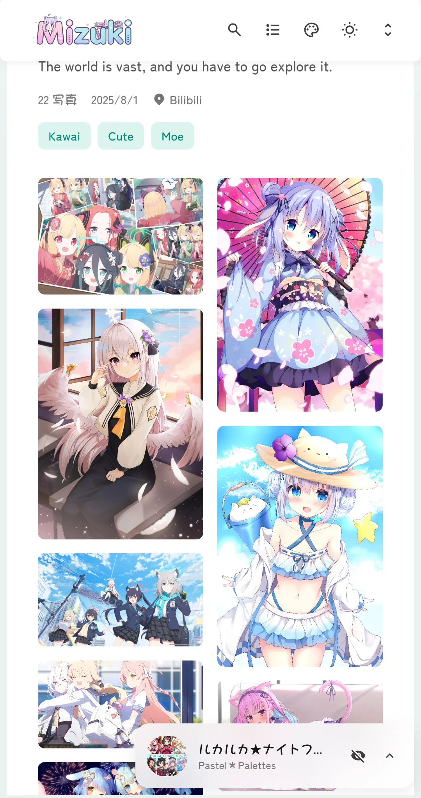
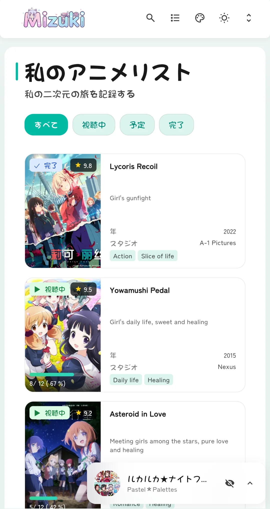
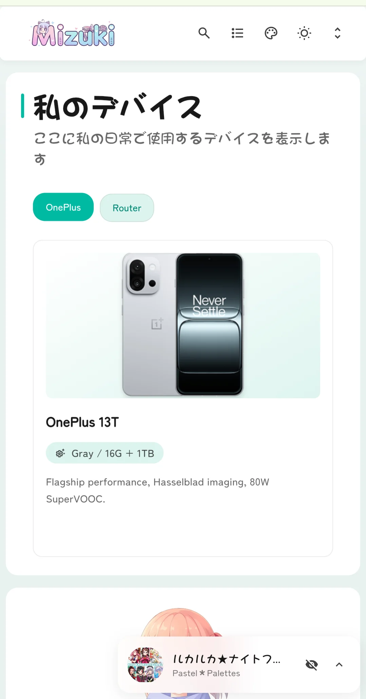
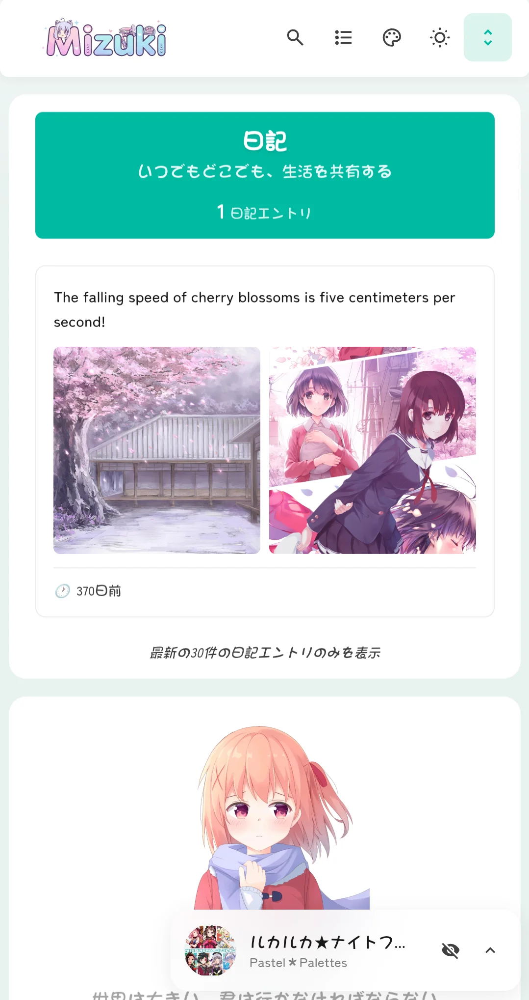
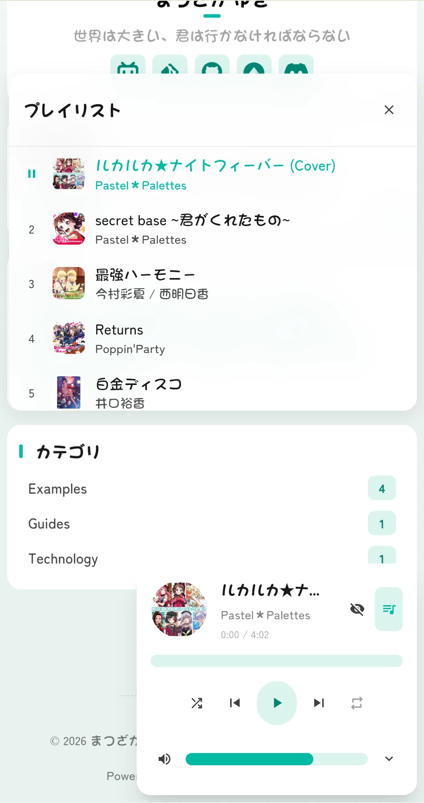

# 🌸 Mizuki 


A modern, feature-rich static blog template built with [Astro](https://astro.build), featuring advanced functionality and beautiful design.

[](https://nodejs.org/)
[](https://pnpm.io/)
[](https://astro.build/)
[](https://www.typescriptlang.org/)
[](https://opensource.org/licenses/Apache-2.0)

[**🖥️ Live Demo**](https://mizuki.mysqil.com/) | [**📝 Documentation**](https://docs.mizuki.mysqil.com/)

🌏 **README Languages:**
[**English**](./README.md) / [**中文**](./README.zh.md) / [**日本語**](./README.ja.md) / [**中文繁体**](./README.tw.md) /

Get started quickly with our comprehensive documentation. Whether you're customizing your theme, configuring features, or deploying to production, the documentation covers everything you need to launch your blog successfully.

[📚 Read Full Documentation](https://docs.mizuki.mysqil.com/) →


<table>
  <tr>
    <td></td>
    <td></td>
    <td></td>
  <tr>
  <tr>
    <td></td>
    <td></td>
    <td></td>
  <tr>
</table>

## 🚀 NEW: Automatic Resolution Adaptation

> **🎯 Automatic Resolution Algorithm** - Intelligently adapts content layout based on device screen resolution, providing the best viewing experience for all devices

🌏 README Language
[**English**](./README.md) /
[**中文**](./README.zh.md) /
[**日本語**](./README.ja.md) /
[**中文繁体**](./README.tw.md) /


### 🔧 Component Configuration System Restructuring
- **Unified Configuration Architecture:** Brand new modular component configuration system, supporting dynamic component management and order configuration
- **Configuration-Driven Component Loading:** Restructured SideBar component, implementing fully configuration-based component loading mechanism
- **Unified Control Switches:** Removed independent enable switches for music player and announcement components, unified control through sidebarLayoutConfig
- **Responsive Layout Adaptation:** Components support responsive layouts, automatically adjusting display based on device type

### 📐 Layout System Optimization
- **Dynamic Sidebar Position Adjustment:** Support for left/right sidebar switching, with automatic layout adaptation
- **Intelligent Article Directory Positioning:** When sidebar is on the right, article navigation automatically moves to the left, providing a better reading experience
- **Grid Layout Improvements:** Optimized CSS Grid layout, resolving container width anomaly issues

### 🎛️ Configuration File Format Standardization
- **Standardized Configuration Format:** Created unified component configuration file format specifications
- **Type Safety:** Comprehensive TypeScript type definitions ensuring configuration type safety
- **Extensibility:** Support for custom component types and configuration options

### 🧹 Code Optimization
- **Test File Cleanup:** Removed unused test configurations and dependencies, reducing project size
- **Code Structure Optimization:** Improved component architecture, enhancing code maintainability
- **Performance Improvement:** Optimized component loading logic, improving page rendering performance

---

## ✨ Features

### 🎨 Design & Interface
- [x] Built with [Astro](https://astro.build) and [Tailwind CSS](https://tailwindcss.com)
- [x] Smooth animations and page transitions using [Swup](https://swup.js.org/)
- [x] Light/dark theme switching with system preference detection
- [x] Customizable theme colors and dynamic banner carousel
- [x] Fullscreen background images with carousel, opacity, and blur effects
- [x] Fully responsive design for all devices
- [x] Beautiful typography with JetBrains Mono font

### 🔍 Content & Search
- [x] Advanced search functionality based on [Pagefind](https://pagefind.app/)
- [x] [Enhanced Markdown features](#-markdown-extensions) with syntax highlighting
- [x] Interactive table of contents with auto-scrolling
- [x] RSS feed generation
- [x] Reading time estimation
- [x] Article categorization and tagging system


### 📱 Special Pages
- [x] **Anime Tracking Page** - Track anime watching progress and ratings
- [x] **Friends Page** - Beautiful cards showcasing friend websites
- [x] **Diary Page** - Share life moments, similar to social media
- [x] **Archive Page** - Organized timeline view of articles
- [x] **About Page** - Customizable personal introduction

### 🛠 Technical Features
- [x] **Enhanced code blocks** based on [Expressive Code](https://expressive-code.com/)
- [x] **Math formula support** with KaTeX rendering
- [x] **Image optimization** with PhotoSwipe gallery integration
- [x] **SEO optimization** including sitemaps and meta tags
- [x] **Performance optimization** with lazy loading and caching
- [x] **Comment system** with Twikoo integration

## 🚀 Quick Start

### 📦 Installation

1. **Clone the repository:**
   ```bash
   git clone https://github.com/matsuzaka-yuki/mizuki.git
   cd mizuki
   ```

2. **Install dependencies:**
   ```bash
   # Install pnpm if not already installed
   npm install -g pnpm
   
   # Install project dependencies
   pnpm install
   ```

3. **Configure your blog:**
   - Edit `src/config.ts` to customize blog settings
   - Update site information, theme colors, banner images, and social links
   - Configure feature page functionality

4. **Start the development server:**
   ```bash
   pnpm dev
   ```
   Your blog will be available at `http://localhost:4321`

### 📝 Content Management

- **Create new posts:** `pnpm new-post <filename>`
- **Edit posts:** Modify files in `src/content/posts/`
- **Customize special pages:** Edit files in `src/content/spec/`
- **Add images:** Place images in `src/assets/` or `public/`

### 🚀 Deployment

Deploy your blog to any static hosting platform:

- **Vercel:** Connect your GitHub repository to Vercel
- **Netlify:** Deploy directly from GitHub
- **GitHub Pages:** Use the included GitHub Actions workflow
- **Cloudflare Pages:** Connect your repository

- **Environment Variable Configuration (Optional):** Refer to `.env.example` for configuration

Before deployment, update the `siteURL` in `src/config.ts`.
**Not recommended** to commit the `.env` file to Git. The `.env` file should only be used for local debugging or building. For cloud platform deployment, it's recommended to configure via the platform's `environment variables` settings.

## 📝 Post Frontmatter Format

```yaml
---
title: My First Blog Post
published: 2023-09-09
description: This is the first post of my new blog.
image: ./cover.jpg
tags: [tag1, tag2]
category: Frontend
draft: false
pinned: false
comment: true
lang: en      # Only set when article language differs from site language in config.ts
---
```

### Frontmatter Field Descriptions

- **title**: Article title (required)
- **published**: Publication date (required)
- **description**: Article description for SEO and previews
- **image**: Cover image path (relative to article file)
- **tags**: Array of tags for categorization
- **category**: Article category
- **draft**: Set to `true` to hide article in production
- **pinned**: Set to `true` to pin article to top
- **comment**: Set to `true` to enable article comment area (requires global comment function enabled)
- **lang**: Article language (only set when different from site default)

### Pinned Articles Feature

The `pinned` field allows you to pin important articles to the top of your blog list. Pinned articles will always appear before regular articles regardless of their publication date.

**Usage:**
```yaml
pinned: true  # Pin this article to the top
pinned: false # Regular article (default)
```

**Sorting Rules:**
1. Pinned articles appear first, sorted by publication date (newest first)
2. Regular articles follow, sorted by publication date (newest first)

### Article-Level Comment Control

The `comment` field allows you to individually control the enabling and disabling of the comment area for each article.

**Usage:**
```yaml
comment: true  # Enable comments (default)
comment: false # Disable comments
```

**Note:**
This feature requires the comment system to be enabled in `src/config.ts` first.

## 🧩 Markdown Extensions

Mizuki supports enhanced features beyond standard GitHub Flavored Markdown:

### 📝 Enhanced Writing
- **Callouts:** Create beautiful annotation boxes using `> [!NOTE]`, `> [!TIP]`, `> [!WARNING]`, etc.
- **Math Formulas:** Write LaTeX math formulas using `$inline$` and `$$block$$` syntax
- **Code Highlighting:** Advanced syntax highlighting with line numbers and copy buttons
- **GitHub Cards:** Embed repository cards using `::github{repo="user/repo"}`

### 🎨 Visual Elements
- **Image Gallery:** Automatic PhotoSwipe integration for image viewing
- **Collapsible Sections:** Create expandable content blocks
- **Custom Components:** Enhance content with special directives

### 📊 Content Organization
- **Table of Contents:** Automatically generated from headings with smooth scrolling
- **Reading Time:** Automatically calculated and displayed
- **Article Metadata:** Rich frontmatter support with categories and tags

## ⚡ Commands

All commands are run from the project root:

| Command                    | Action                                   |
|:---------------------------|:-----------------------------------------|
| `pnpm install`             | Install dependencies                     |
| `pnpm dev`                 | Start local dev server at `localhost:4321` |
| `pnpm build`               | Build production site to `./dist/`       |
| `pnpm preview`             | Preview build locally before deployment  |
| `pnpm check`               | Run Astro error checking                 |
| `pnpm format`              | Format code with Prettier                   |
| `pnpm lint`                | Check and fix code issues                |
| `pnpm new-post <filename>` | Create a new blog post                   |
| `pnpm astro ...`           | Run Astro CLI commands                   |

## 🎯 Configuration Guide

### 🔧 Basic Configuration

Edit `src/config.ts` to customize your blog:

```typescript
export const siteConfig: SiteConfig = {
  title: "Your Blog Name",
  subtitle: "Your Blog Description",
  lang: "en", // or "zh-CN", "ja", etc.
  themeColor: {
    hue: 210, // 0-360, theme hue
    fixed: false, // Hide theme color picker
  },
  banner: {
    enable: true,
    src: ["assets/banner/1.webp"], // Banner images
    carousel: {
      enable: true,
      interval: 0.8, // seconds
    },
  },
};
```

### 📱 Feature Page Configuration

- **Anime Page:** Edit anime list in `src/pages/anime.astro`
- **Friends Page:** Edit friend data in `src/content/spec/friends.md`
- **Diary Page:** Edit moments in `src/pages/diary.astro`
- **About Page:** Edit content in `src/content/spec/about.md`

### 📦 Code-Content Separation (Optional)

Mizuki supports separating code and content into two independent repositories, suitable for team collaboration and large projects.

**Quick Selection**:

| Use Case | Configuration | For Whom |
|---------|---------|---------|
| 🆕 **Local Mode** (default) | No configuration, use directly | Beginners, personal blogs |
| 🔧 **Separation Mode** | Set `ENABLE_CONTENT_SYNC=true` | Team collaboration, private content |

**One-Click Enable/Disable**:

```bash
# Method 1: Local Mode (recommended for beginners)
# No need to create .env file, run directly
pnpm dev

# Method 2: Content Separation Mode
# 1. Copy configuration file
cp .env.example .env

# 2. Edit .env to enable content separation
ENABLE_CONTENT_SYNC=true
CONTENT_REPO_URL=https://github.com/your-username/Mizuki-Content.git

# 3. Sync content
pnpm run sync-content
```

**Features**:
- ✅ Supports public and private repositories 🔐
- ✅ One-click enable/disable without code modification
- ✅ Auto-sync, pulls latest content automatically before development

📖 **Detailed Configuration**: [Content Separation Guide](docs/CONTENT_SEPARATION.md)
🔄 **Migration Tutorial**: [Migrate from Single Repo to Separation Mode](docs/MIGRATION_GUIDE.md)
📚 **More Documentation**: [Documentation Index](docs/README.md)

## ✏️ Contributing

Contributions are welcome! Feel free to submit issues and pull requests.

1. Fork the repository
2. Create a feature branch (`git checkout -b feature/amazing-feature`)
3. Commit your changes (`git commit -m 'Add some amazing feature'`)
4. Push to the branch (`git push origin feature/amazing-feature`)
5. Open a Pull Request

## 📄 License

This project is licensed under the Apache License 2.0 - see the [LICENSE](LICENSE) file for details.

### Original Project License

This project is based on [Fuwari](https://github.com/saicaca/fuwari), which is licensed under the MIT License. The original copyright notice and permission notice are included in the LICENSE.MIT file in accordance with the MIT License requirements.

## 🙏 Acknowledgements

- Based on the original [Fuwari](https://github.com/saicaca/fuwari) template
- Inspired by [Yukina](https://github.com/WhitePaper233/yukina) - a beautiful and elegant blog template
- Some designs are inspired by [Firefly](https://github.com/CuteLeaf/Firefly) & [Twilight](https://github.com/spr-aachen/Twilight) templates
- Uses [Pio](https://github.com/Dreamer-Paul/Pio) to implement the adorable Live2D mascot plugin
- Built with [Astro](https://astro.build) and [Tailwind CSS](https://tailwindcss.com)
- Icons from [Iconify](https://iconify.design/)

### 🌸 Special Thanks

- **[Fuwari](https://github.com/saicaca/fuwari)** by saicaca - The original template that this project is based on. Thank you for creating such a beautiful and functional template.
- **[Yukina](https://github.com/WhitePaper233/yukina)** - Thanks for providing design inspiration and creativity that helped shape this project. Yukina is an elegant blog template that demonstrates excellent design principles and user experience.
- **[Firefly](https://github.com/CuteLeaf/Firefly)** - Thanks for providing excellent layout design ideas. The dual sidebar layout, article dual-column grid layout, and some widget designs and implementations have enriched Mizuki's interface.
- **[Twilight](https://github.com/spr-aachen/Twilight)** - Thanks for providing inspiration and technical support. Twilight's dynamic wallpaper modes switching system, responsive design and transition effects have greatly enhanced the user experience of Mizuki.

## 🍀 Contributors

Thanks to all contributors for their contributions to this project. If you have any questions or suggestions, please submit an [Issue](https://github.com/matsuzaka-yuki/Mizuki/issues) or [Pull Request](https://github.com/matsuzaka-yuki/Mizuki/pulls).

<a href="https://github.com/matsuzaka-yuki/Mizuki/graphs/contributors">
  
</a>

## ⭐ Star History

[](https://star-history.com/#matsuzaka-yuki/Mizuki&Date)
---

⭐ If you find this project helpful, please consider giving it a star!
