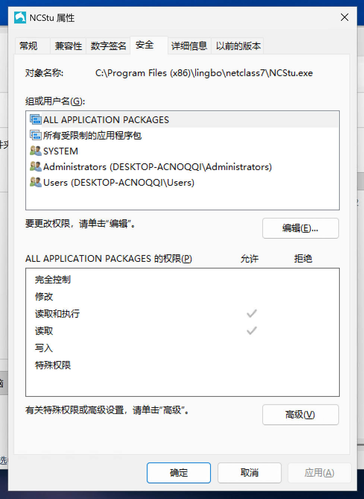
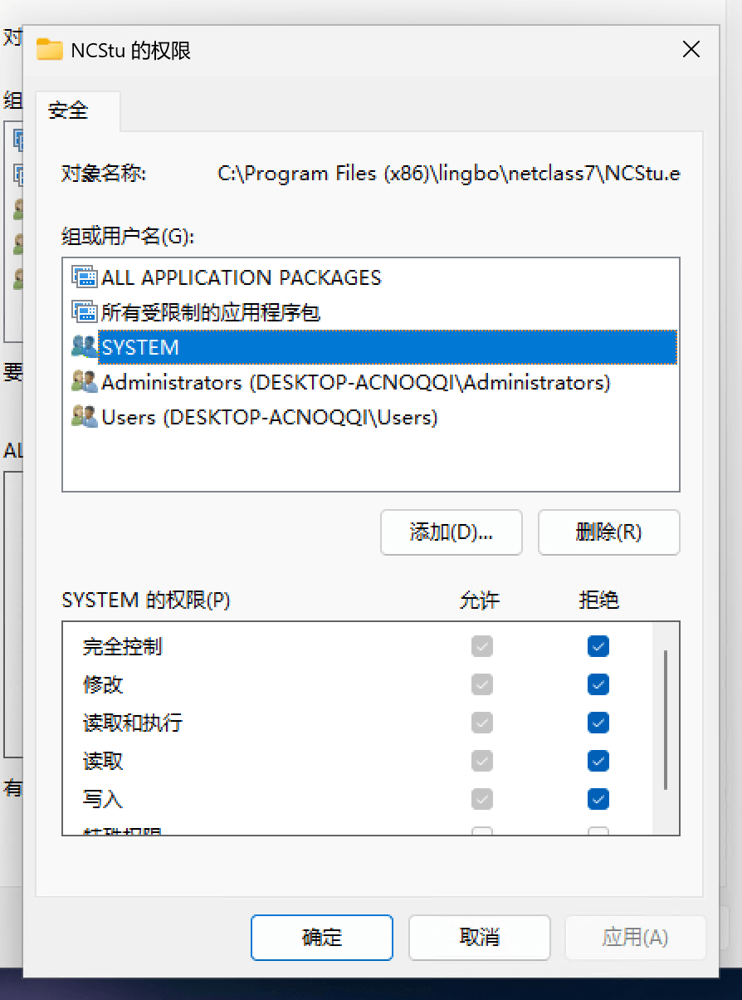

## 0 前言

近期在给 SCLTK 更新内建规则时发现了一款电子教室软件，名为 “凌波网络教学系统”（以下简称 “凌波”）。

经过分析后，不难发先其主要进程为 `NCStu.exe` 和 `NCCmn.dll`。然而，令人诧异的是，如果用户在任务管理器内直接结束这两个进程，两个进程将几乎在同一时刻重启，任务管理器会也被该软件定期强制关闭。不过，道高一尺魔高一丈，也有一些简单的操作能够破解该软件。

## 1 权限法

1. 打开 “凌波” 安装目录。
2. 选中 `NCStu.exe`，单击右键，左键单击 “属性”，在弹出的窗口中左键单击 “安全” 选项卡。 
3. 左键单击 “编辑”。在弹出的窗口中，左键单击 “组或用户名” 下的 “SYSTEM”。在 “SYSTEM” 的权限一栏，勾选 “拒绝” 一列的复选框。
4. 左键单击 “确定”，左键单击弹出的警告窗口的 “是”，再次左键单击 “属性” 窗口的 “确定”。
5. 对 `NCCmn.dll` 重复上述步骤。
6. 打开任务管理器，找到进程 `NCStu.exe` 和 `NCCmn.dll`，分别选中，分别左键单击 “结束任务”。也可以执行如下命令：

```batch
taskkill /f /im NCStu.exe
taskkill /f /im NCCmn.dll
```

## 2 注册表法

1. 打开注册表编辑器，定位到 `HKEY_LOCAL_MACHINE\SOFTWARE\Microsoft\Windows NT\CurrentVersion\Image File Execution Options`。
2. 右键单击 `Image File Execution Options`，选择 “新建”，再左键单击 “项”，输入 `NCStu.exe`。
3. 左键单击 `NCStu.exe`，在右侧空白处右键单击，选择 “新建”。再左键单击 “字符串值”，输入 `Debugger`。
4. 左键双击 `Debugger`，在弹出的窗口中输入 `nul`，左键点击确定，关闭注册表编辑器。
5. 对 `NCCmn.dll` 重复上述步骤。
6. 结束进程 `NCStu.exe` 和 `NCCmn.dll`。

> [!NOTE]
> 上述步骤可通过执行下面的命令代替：
> ```batch
> reg add "HKLM\SOFTWARE\Microsoft\Windows NT\CurrentVersion\Image File Execution Options\NCStu.exe" /v Debugger /t REG_SZ /d "nul" /f
> reg add "HKLM\SOFTWARE\Microsoft\Windows NT\CurrentVersion\Image File Execution Options\NCCmn.dll" /v Debugger /t REG_SZ /d "nul" /f
> ```
