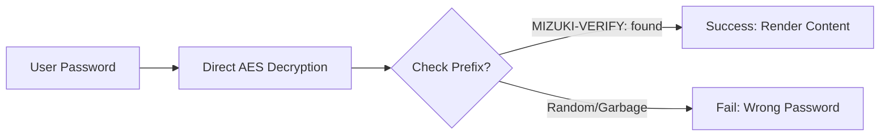

This blog template is built with [Astro](https://astro.build/). For the things that are not mentioned in this guide, you may find the answers in the [Astro Docs](https://docs.astro.build/).

## Front-matter of Posts

```yaml
---
title: My First Blog Post
published: 2023-09-09
description: This is the first post of my new Astro blog.
image: ./cover.jpg
tags: [Foo, Bar]
category: Front-end
draft: false
---
```


| Attribute     | Description                                                                                                                                                                                                 |
|---------------|-------------------------------------------------------------------------------------------------------------------------------------------------------------------------------------------------------------|
| `title`       | The title of the post.                                                                                                                                                                                      |
| `published`   | The date the post was published.                                                                                                                                                                            |
| `pinned`      | Whether this post is pinned to the top of the post list.                                                                                                                                                   |
| `description` | A short description of the post. Displayed on index page.                                                                                                                                                   |
| `image`       | The cover image path of the post.<br/>1. Start with `http://` or `https://`: Use web image<br/>2. Start with `/`: For image in `public` dir<br/>3. With none of the prefixes: Relative to the markdown file |
| `tags`        | The tags of the post.                                                                                                                                                                                       |
| `category`    | The category of the post.                                                                                                                                                                                   |
| `alias`   | alias for the post. The post will be accessible at `/posts/{alias}/`. Example: `my-special-article` (will be available at `/posts/my-special-article/`)                                   |
| `licenseName` | The license name for the post content.                                                                                                                                                                      |
| `author`      | The author of the post.                                                                                                                                                                                     |
| `sourceLink`  | The source link or reference for the post content.                                                                                                                                                          |
| `draft`       | If this post is still a draft, which won't be displayed.                                                                                                                                                    |

## Where to Place the Post Files


Your post files should be placed in `src/content/posts/` directory. You can also create sub-directories to better organize your posts and assets.

```
src/content/posts/
├── post-1.md
└── post-2/
    ├── cover.png
    └── index.md
```

## Posts alias

You can set a alias for any post by adding the `alias` field to the front-matter:

```yaml
---
title: My Special Article
published: 2024-01-15
alias: "my-special-article"
tags: ["Example"]
category: "Technology"
---
```

When a alias is set:
- The post will be accessible at the custom URL (e.g., `/posts/my-special-article/`)
- The default `/posts/{slug}/` URL will still work
- RSS/Atom feeds will use the custom alias
- All internal links will automatically use the custom alias

**Important Notes:**
- Alias should NOT include `/posts/` prefix (it will be added automatically)
- Avoid special characters and spaces in alias
- Use lowercase letters and hyphens for best SEO practices
- Make sure alias are unique across all posts
- Don't include leading or trailing slashes


## How It Works


