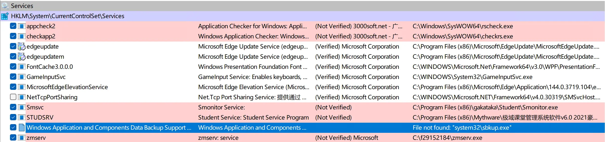
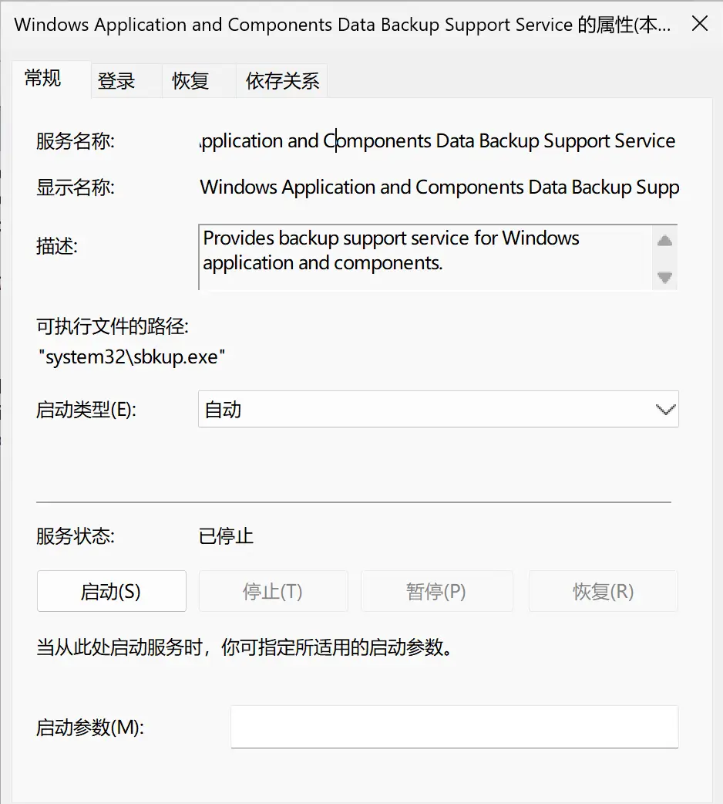
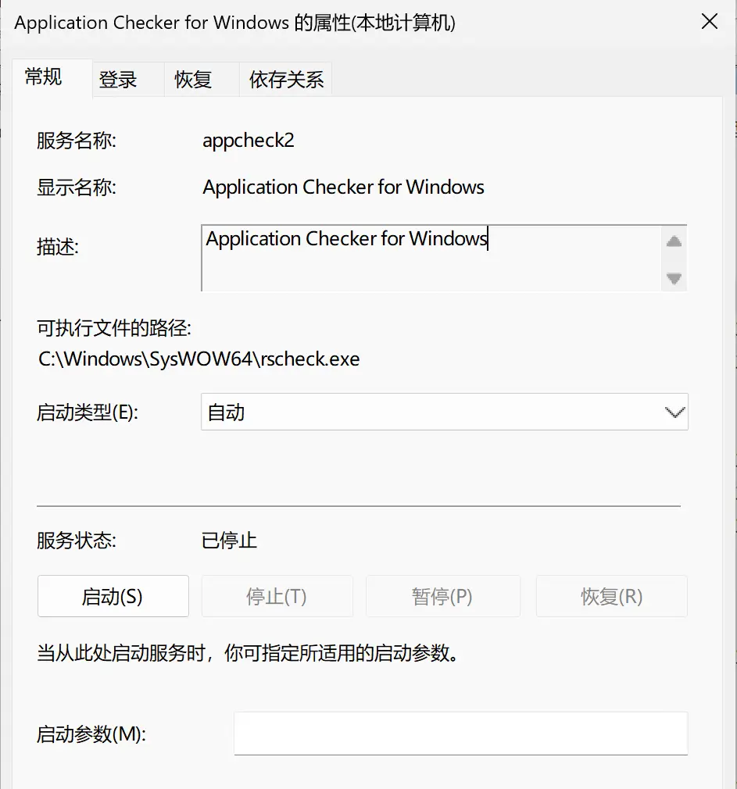

最近在给 SCLTK 更新破解/恢复规则，心血来潮想把 “凌波网络教学系统” （下文简称 “凌波”）也纳入 SCLTK 可破解的范畴。SCLTK 破解学生电子教室软件，无非就需要两类东西——进程和服务或驱动程序，使用 Process Explorer、Process Monitor、Autoruns，外加任意一款第三方卸载工具，就能获取这些东西。

首先就是打开“凌波”安装目录看看有哪些 `.exe` 文件，还是很容易获得的。

（“凌波” 分发了以 GPL v2.0 许可证开源的 MPV，但连许可证文件都没保留，可耻！）

接下来转到 Process Explorer，找到 `NCStu.exe` 所在的进程树。

经过尝试，终止 `NCStu.exe` 和 `NCCmn.dll` 后，这两个进程又会快速重启，看来是有守护进程进程。自然，我们就可以猜测 `sbkup.exe` 是这两个进程的守护进程。不妨查看 `sbkup.exe` 的属性。

（注意 Autostart Location 下的信息，后面要考）

等等，在 `C:\Windows\System32` 下？！难道“凌波”注入了系统进程？好奇中，我尝试终止了 `sbkup.exe` 及其子进程，然而，系统并没有任何异常。

暂时先把 `sbkup.exe` 放在一边，紧接着查看 Autoruns 的信息。

嗯？这个 Windows 开头的服务，竟然对应的文件不存在！并且，`sbkup.exe` 再次出现！

我顺着服务名最终找到了对应的服务。

服务描述翻译过来是：为 Windows 应用程序与组件提供备份支持服务。

不难发现，描述存在语法错误，作为祈使句动词的 “Provide” 不应该是第三人称单数形式，微软程序员少有这种低级错误。经过一番查找，可以确定，这个 “Windows Application and Components Data Backup Support Service” 不是 Windows 的系统服务。自然，这只能是 “凌波” 安装时注册的服务！

这种伪装为系统服务的现象在其他电子教室软件中同样存在，例如“红蜘蛛电子教室”。

这种做法的恶心之处在于：第三方卸载工具很难扫描到这些 “伪系统服务”，破解工具开发者如果不观察进程树或安装器的 Windows API 调用，难以知晓。从侧面，也可以凸显这些电子教室软件开发者技术之拙劣，明明有的是办法可以隐藏进程，却还用这么低级的方式自我催眠 “我的想法很绝妙”。孰优孰劣，高下立判。
