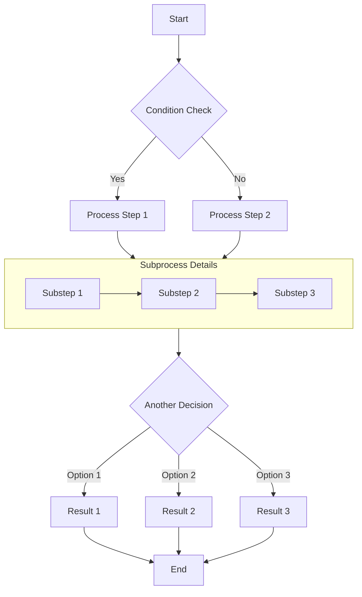
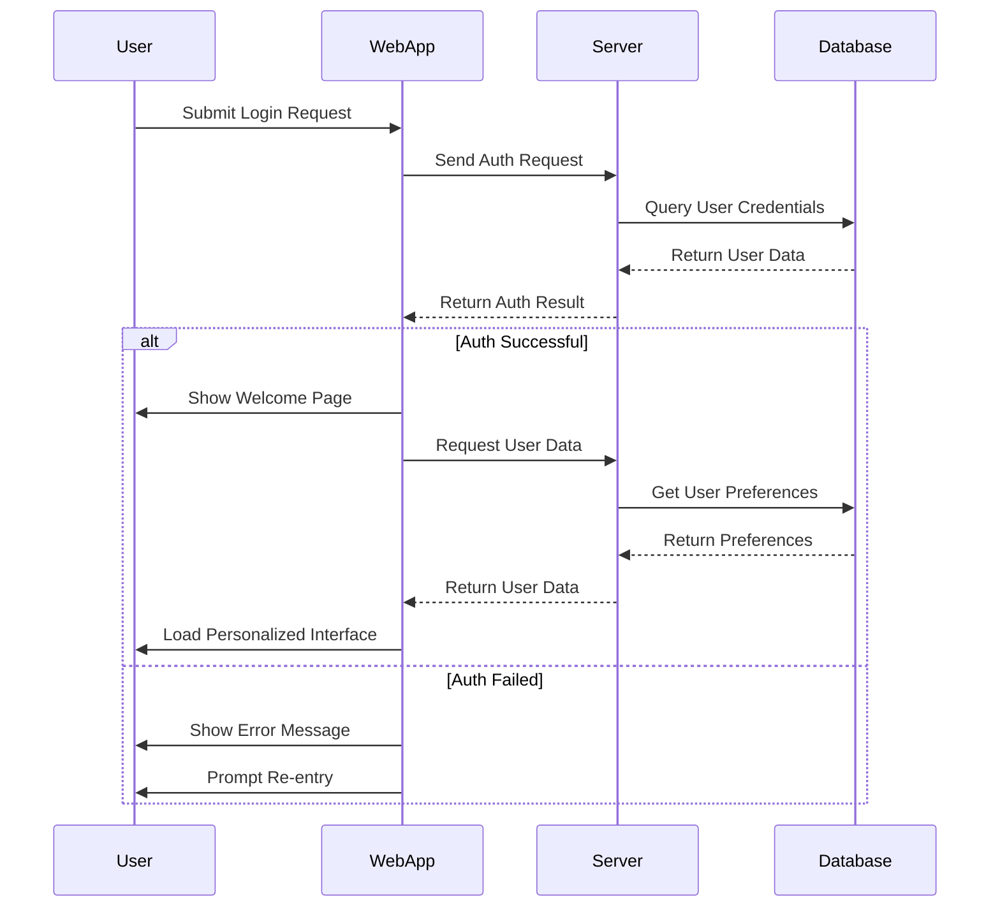
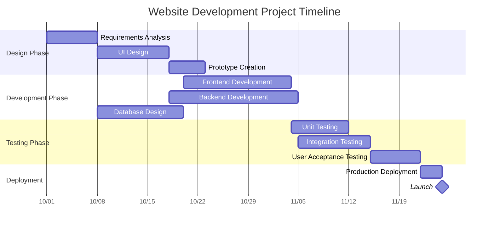
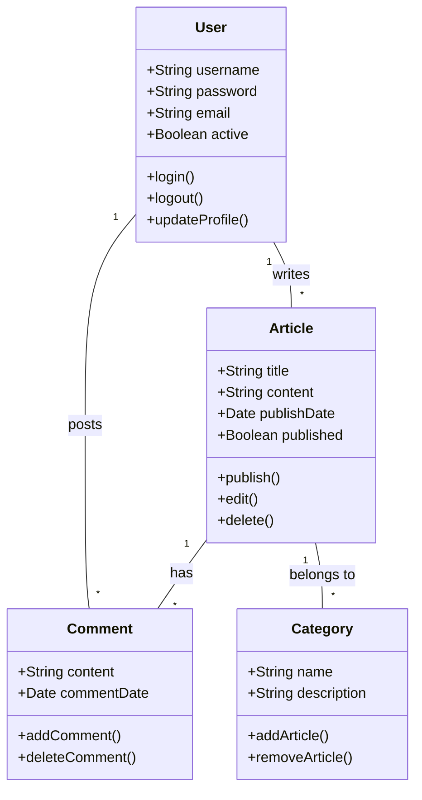
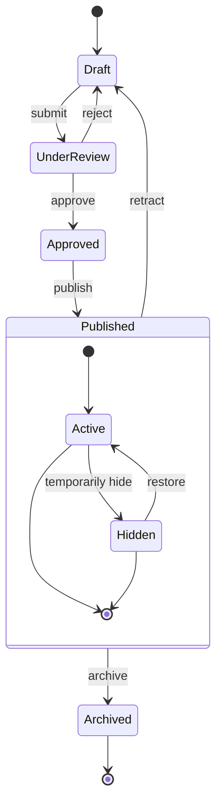
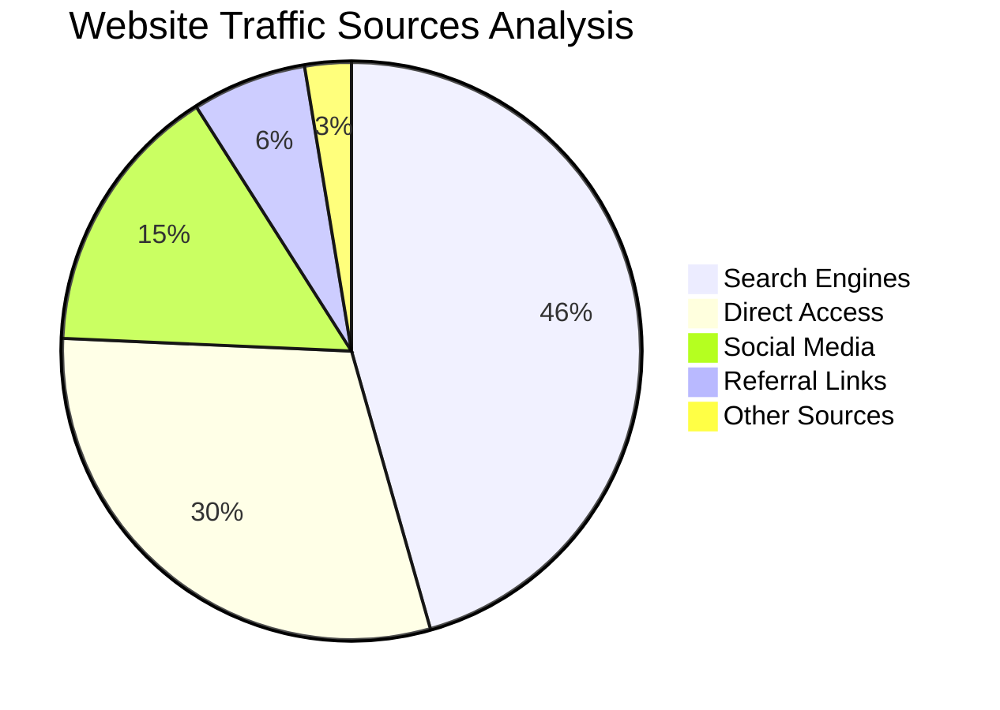

# Complete Guide to Markdown with Mermaid Diagrams

This article demonstrates how to create various complex diagrams using Mermaid in Markdown documents, including flowcharts, sequence diagrams, Gantt charts, class diagrams, and state diagrams.

## Flowchart Example

Flowcharts are excellent for representing processes or algorithm steps.

## Sequence Diagram Example

Sequence diagrams show interactions between objects over time.

## Gantt Chart Example

Gantt charts are perfect for displaying project schedules and timelines.

## Class Diagram Example

Class diagrams show the static structure of a system, including classes, attributes, methods, and their relationships.

## State Diagram Example

State diagrams show the sequence of states an object goes through during its life cycle.

## Pie Chart Example

Pie charts are ideal for displaying proportions and percentage data.

## Conclusion

Mermaid is a powerful tool for creating various types of diagrams in Markdown documents. This article demonstrated how to use flowcharts, sequence diagrams, Gantt charts, class diagrams, state diagrams, and pie charts. These diagrams can help you express complex concepts, processes, and data structures more clearly.

To use Mermaid, simply specify the mermaid language in a code block and describe the diagram using concise text syntax. Mermaid will automatically convert these descriptions into beautiful visual diagrams.

Try using Mermaid diagrams in your next technical blog post or project documentation - they will make your content more professional and easier to understand!